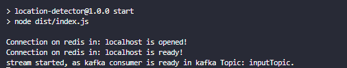

# Location-Detector &nbsp;

<a name="ancora"></a>

**_created by: bruno.souza_** 👨‍💻

**_contact me: [bruno.d3v.souza@gmail.com](mailto:bruno.d3v.souza@gmail.com)_** 📨

## Súmario

- [Instruções Gerais](#ancora1)
- [Iniciando a Aplicação](#ancora2)

---
<a id="ancora1"></a>

## 🔎 Instruções gerais de execução do compose

- Para subir os contêineres que estão especificados no docker-compose, navegue até a pasta do projeto onde se encontra seu arquivo **docker-compose.yml**, na sequência execute os comandos abaixo.
<br>

### Subir docker-compose

- O mesmo irá subir todos os contêineres descritos no arquivo (**.yml**).

- _Flag (-d) -> detached, execução em backgroud, não trava seu console._
- _Flag (-build) -> build, caso seu **docker-compose.yml** possua contêineres que sobem por um **dockerFile** a flag e utilizada para reconstruir a imagem para aplicar alterações feitas pós primeira execução._

```Shell
docker-compose up -d
```

### Subir apenas um contêiner

```Shell
docker-compose up -d <container_name>
```

### Parar docker-compose

```Shell
docker-compose down
```

### Parar um contêiner

```Shell
docker-compose stop <container_name>
```

### Printar .env de algum container buildado pelo docker-compose

```Shell
docker exec <container_name> printenv
```

### Acessar contêiner

- _Flag (-it) -> interative, que você vai entrar em modo de interação com o contêiner._
- _Neste caso você pode optar entre (bash | sh) para acesso ao contêiner (A depender da imagem)._

```Shell
docker exec -it <container_name> bash
```

### Logs contêiner

- _Flag (--tail) -> tail, numero de linhas visualizados do log._

- _Flag (-f) -> follow, os logs ficaram travados no console seguindo os logs seguintes emitidos pelo contêiner._  

```Shell
docker logs --tail <numero_linhas> -f <container_name>
```

<br>

<a id="ancora1"></a>

# 📦 Utilizando a Aplicação

### Variaveis de Ambiente

1. Abrir o projeto na sua máquina;

2. Criar um arquivo (**.env**);

```Shell
touch .env
```

Abra para edição o arquivo **.env**:

```Shell
nano .env
```

Insira as variáveis de ambiente do projeto pré-definidas:

```YAML
#APP
INPUT_TOPIC=inputTopic
OUTPUT_TOPIC=outputTopic

#Redis
REDIS_HOST="localhost"
REDIS_PORT=6379
TTL_REDIS=1800

#IPSTRACK
TOKEN_IPSTACK=<Your-token>
```

*_Obs: A variável **TOKEN_IPSTACK** referece ao token da api pública que você pode obter gratuitamente acessando este link [ipstack](https://ipstack.com/)._*

### Por default o kafka container vai criar dois tópicos descritos no seu arquivo (**.yml**), sendo eles o inputTopic e outputTopic confome descrito também no arquivo (**.env**)

*_Obs: O mesmo pode ser modificado para se criar tópicos de sua preferência sejá declarando na variável do docker ou criando manualmente, lembrando apenas de modificar as variáveis de ambiente para que aplicação funcione corretamente._*

```YAML
 kafka:
    image: wurstmeister/kafka
    container_name: kafka
    ports:
      - "9092:9092"
    environment:
      KAFKA_ADVERTISED_HOST_NAME: localhost
      KAFKA_ZOOKEEPER_CONNECT: zookeeper:2181
      KAFKA_CREATE_TOPICS: "inputTopic:1:1,outputTopic:1:1"
      KAFKA_AUTO_CREATE_TOPICS_ENABLE: "true"
```

### Para publicar informações no tópico para ver a execução do projeto basta, definir um producer e um consumer encima dos tópicos criados conforme instrução abaixo

Para definir o producer que vai receber os dados que o streming vai consumir:

```SHELL
 docker exec -it kafka /opt/kafka/bin/kafka-console-producer.sh --bootstrap-server localhost:9092 --topic <topic_name>
```

_Ex: docker exec -it kafka /opt/kafka/bin/kafka-console-producer.sh --bootstrap-server localhost:9092 --topic inputTopic._

Para definir o consumer que receberá os dados resultantes da aplicação:
  
```SHELL
 docker exec -it kafka /opt/kafka/bin/kafka-console-consumer.sh --bootstrap-server localhost:9092 --topic <topic_name>
```

*_Ex: docker exec -it kafka /opt/kafka/bin/kafka-console-consumer.sh --bootstrap-server localhost:9092 --topic outputTopic._*

### Exemplo de entrada de dados

```JSON
 {"clientId": "1", "timestamp":"1682373577", "ip": "000.000.000.000"}
```

### Exemplo de saída de dados

```JSON
 {
  "clientId":"1",
  "timestamp":"1682373577",
  "ip":"000.000.000.000",
  "latitude":-00.000000000000000,
  "longitude":-00.00000000000000,
  "country":"South America",
  "region":"São Paulo",
  "city":"Franca"
  }
```

<a id="ancora2"></a>

# ⚙️ Iniciando a Aplicação

### Para iniciar a aplicação basta executar os seguintes comandos

<br>

#### Este comando vai gerar o build da aplicação

```SHELL
npm run build
```

#### Após o build ser gerado basta rodar este comando

```SHELL
npm run start
```

### Saída gerada pela aplicação



#### Após a inicialização da aplicação por meio do producer e consumer, basta inserir dados e aguardar a saída dos mesmos

*_Obs: A aplicação faz uso do Redis banco de cache para controle dos dados gerados, gerando apenas uma informação por TTL definido na (**.env**) arquivo que por default será 30 min retornando um IP e client._*